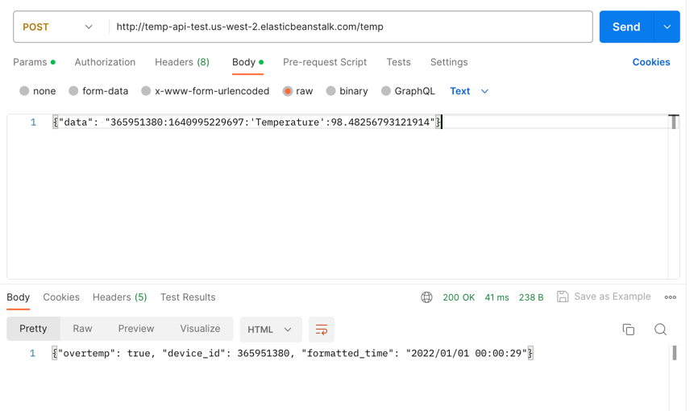
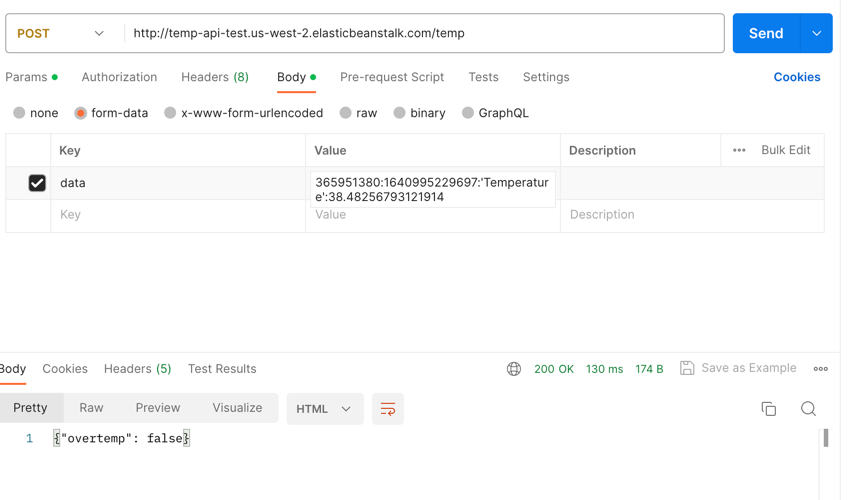
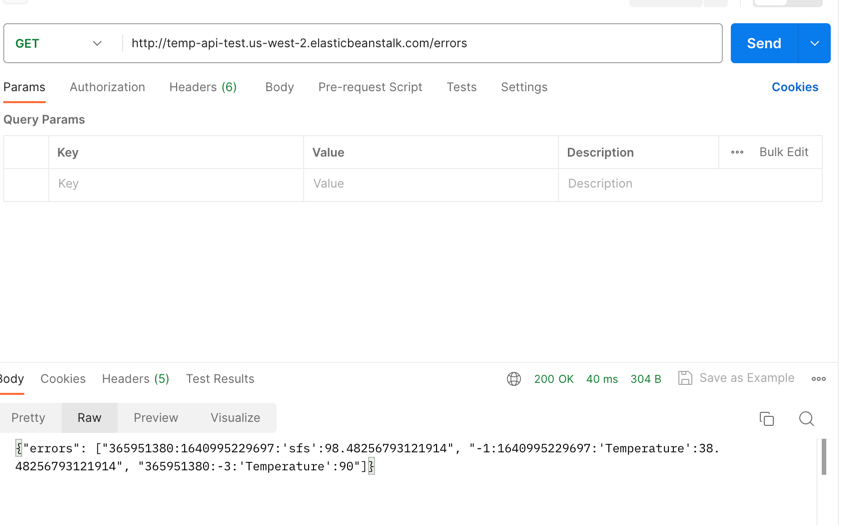
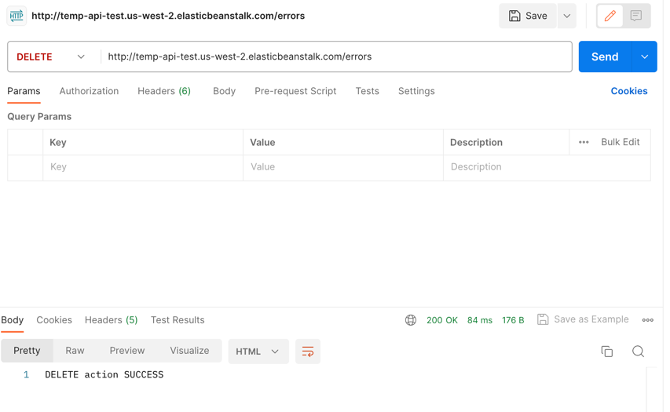

# temperature-api
## `POST` request at `/temp`
It's expecting either a raw json string of `{"data": __data_string__}` 
or form-data with an entry of "data". If other content type is received, will return a 415 error.

In the `record_temp` method, I'm checking these following conditions:
- "`__data_string__`" contains four colon separated fields
- check if `device_id` is a non-negative int32
- check if `epoch_ms` is a non-negative int64
- check if the 3rd field is `'Temperature'` exact value
- check if `temp` is float

If any of the conditions isn't met, will get an 400 error.

If `temp` >= 90, return `overtemp` as True, device id and formatted timestamp in json form
If `temp` < 90, return `overtemp` as False in json form

## `Get` request at `/errors`
Return a list of original `__data_string__` which produced a 400 error.

## `DELETE` request at `/errors`
Run a delete all on the storage (sqlite database) and return "DELETE action SUCCESS" string.
